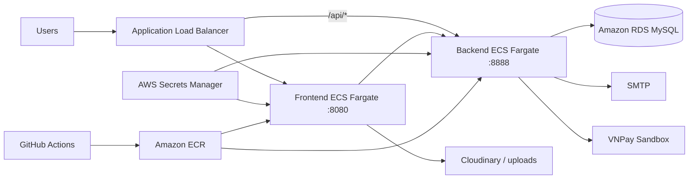

# EduFlow online learning platform

## 1. Executive summary

EduFlow manages the full course lifecycle in one platform: instructor account administration, course authoring, VNPay checkout, lesson delivery, and learning progress. The proposed solution favors an understandable architecture, repeatable Terraform deployment, and an MVP-sized operating model.

## 2. Problem statement

- Course content, orders, and progress are often split across disconnected systems.
- Mock data and static pages produce inconsistent behavior and weak testability.
- Manual deployments cause configuration drift, secret exposure risks, and slow recovery.
- Student, instructor, and administrator privileges must be enforced in both the web layer and API.

## 3. Proposed solution

| Layer          | Components                             | Responsibility                                          |
| -------------- | -------------------------------------- | ------------------------------------------------------- |
| Web            | Spring Boot, Thymeleaf, i18n           | Public pages, role dashboards, forms, and login session |
| API            | Spring Boot REST, Security, JWT        | Account, course, lesson, order, OTP, and progress rules |
| Data           | MySQL 8, Spring Data JPA               | Accounts, catalog, content, orders, and progress        |
| Integrations   | VNPay, SMTP, Cloudinary/local media    | Payments, OTP/email, and rich learning content          |
| Infrastructure | Docker, ECR, ECS Fargate, ALB, RDS, S3 | Packaging, routing, compute, and storage                |
| Automation     | Terraform, GitHub Actions              | Repeatable infrastructure, tests, and deployment        |

## 4. Target architecture

## 5. Functional scope

- Students: registration, OTP verification, sign-in, discovery, discounts, payment, learning, and progress.
- Instructors: courses, chapters, video/document lessons, students, orders, and earnings.
- Administrators: system metrics, instructor creation, and account status control.
- Operations: health checks, non-privileged containers, environment/Secrets Manager configuration, and test-gated delivery.

## 6. Non-functional requirements

- Least-privilege authorization with server-side API enforcement.
- Consistent Vietnamese/English copy and VND currency formatting.
- Explicit frontend-to-backend timeouts and actionable checkout errors.
- Reproducible infrastructure validated with `terraform validate`.
- Independent Maven test suites for frontend and backend.

## 7. Delivery milestones

1. Normalize the data model and API surface.
2. Complete student, instructor, and administrator journeys.
3. Integrate OTP, VNPay, media, and internationalization.
4. Add tests, load checks, and security hardening.
5. Containerize, model AWS in Terraform, and automate CI/CD.

## 8. Risks and mitigations

| Risk                                  | Impact                              | Mitigation                                                            |
| ------------------------------------- | ----------------------------------- | --------------------------------------------------------------------- |
| JWT mismatch between services         | Login failure or invalid tokens     | Supply one secret through Secrets Manager and test authentication     |
| Incorrect payment callback/signature  | Orders remain unconfirmed           | Normalize amount/encoding, set return origin, and test callbacks      |
| Container upload path is not writable | Instructor authoring fails          | Create a writable directory during build and assert permissions in CI |
| Slow/unavailable backend              | Hung requests or generic 500 errors | Connection/read timeouts, ALB health checks, and clear error messages |
| AWS cost growth                       | MVP budget overrun                  | Small dev sizing, low desired counts, and workshop cleanup            |

## 9. Proposed success criteria

The proposed criteria are: the authoring-to-purchase-to-learning path uses real data; Maven tests and Terraform validation pass; both containers run behind the ALB; and secrets are not committed to source control. The Workshop section identifies which criteria have evidence instead of assuming that all criteria were met.
