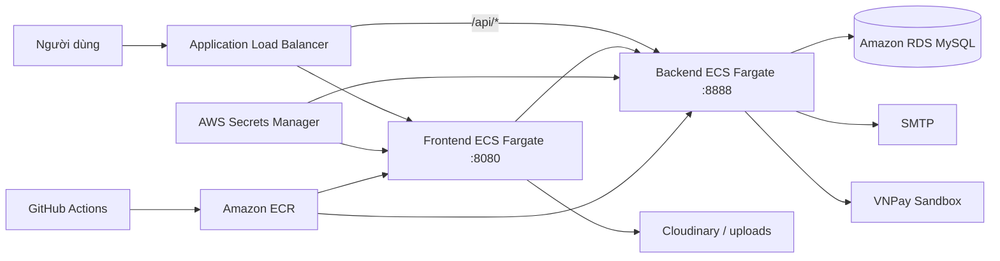

# Đề xuất nền tảng học trực tuyến EduFlow

## 1. Tóm tắt

EduFlow giải quyết nhu cầu quản lý toàn bộ vòng đời khóa học trên một nền tảng: quản trị tài khoản giảng viên, biên soạn nội dung, bán khóa học qua VNPay, học bài và theo dõi tiến độ. Giải pháp ưu tiên kiến trúc dễ hiểu, có thể triển khai lặp lại bằng Terraform và phù hợp với một sản phẩm MVP.

## 2. Vấn đề

- Nội dung khóa học, đơn hàng và tiến độ thường nằm ở các hệ thống rời rạc.
- Dữ liệu giả hoặc trang tĩnh làm trải nghiệm không nhất quán và khó kiểm thử.
- Triển khai thủ công dễ tạo sai khác cấu hình, lộ bí mật và kéo dài thời gian phục hồi.
- Quyền giữa học viên, giảng viên và quản trị viên cần được kiểm soát ở cả giao diện lẫn API.

## 3. Giải pháp

| Lớp         | Thành phần                             | Trách nhiệm                                                             |
| ----------- | -------------------------------------- | ----------------------------------------------------------------------- |
| Web         | Spring Boot, Thymeleaf, i18n           | Trang công khai, dashboard theo vai trò, biểu mẫu và phiên đăng nhập    |
| API         | Spring Boot REST, Security, JWT        | Nghiệp vụ tài khoản, khóa học, bài học, đơn hàng, OTP và tiến độ        |
| Dữ liệu     | MySQL 8, Spring Data JPA               | Lưu tài khoản, danh mục, khóa học, chương, bài học, đơn hàng và tiến độ |
| Tích hợp    | VNPay, SMTP, Cloudinary/local media    | Thanh toán, OTP/email và nội dung đa phương tiện                        |
| Hạ tầng     | Docker, ECR, ECS Fargate, ALB, RDS, S3 | Đóng gói, định tuyến, chạy dịch vụ và lưu trữ                           |
| Tự động hóa | Terraform, GitHub Actions              | Tạo hạ tầng, kiểm thử và triển khai nhất quán                           |

## 4. Kiến trúc mục tiêu

## 5. Phạm vi chức năng

- Học viên: đăng ký, xác thực OTP, đăng nhập, tìm khóa học, áp mã giảm giá, thanh toán, học và theo dõi tiến độ.
- Giảng viên: quản lý khóa học, chương, bài học video/tài liệu, học viên, đơn hàng và doanh thu.
- Quản trị viên: xem chỉ số hệ thống, tạo tài khoản giảng viên và khóa/mở tài khoản.
- Vận hành: health check, container không đặc quyền, bí mật từ biến môi trường/Secrets Manager, pipeline có bước kiểm thử.

## 6. Yêu cầu phi chức năng

- Bảo mật theo nguyên tắc quyền tối thiểu và kiểm tra quyền ở API.
- Nội dung tiếng Việt/Anh nhất quán, giá tiền hiển thị theo VND.
- Timeout rõ ràng giữa frontend và backend; lỗi thanh toán được phản hồi cho người dùng.
- Hạ tầng có thể tái tạo và kiểm tra bằng `terraform validate`.
- Hai bộ Maven test độc lập cho frontend và backend.

## 7. Mốc triển khai

1. Chuẩn hóa mô hình dữ liệu và API.
2. Hoàn thiện luồng học viên, giảng viên và quản trị viên.
3. Tích hợp OTP, VNPay, media và i18n.
4. Bổ sung kiểm thử, tải thử và hardening bảo mật.
5. Đóng gói Docker, mô hình hóa AWS bằng Terraform và tự động hóa CI/CD.

## 8. Rủi ro và giảm thiểu

| Rủi ro                                | Ảnh hưởng                                    | Giảm thiểu                                                             |
| ------------------------------------- | -------------------------------------------- | ---------------------------------------------------------------------- |
| Sai cấu hình JWT giữa hai dịch vụ     | Không đăng nhập được hoặc token không hợp lệ | Dùng cùng bí mật qua Secrets Manager và kiểm thử luồng xác thực        |
| Callback thanh toán sai origin/chữ ký | Đơn hàng không được xác nhận                 | Chuẩn hóa amount/encoding, cấu hình return origin và test callback     |
| Upload không ghi được trong container | Giảng viên không tạo được nội dung           | Tạo thư mục ghi được khi build và kiểm tra quyền trong CI              |
| Backend chậm/không sẵn sàng           | Frontend treo hoặc trả 500                   | Timeout kết nối/đọc, health check ALB và thông báo lỗi rõ ràng         |
| Chi phí AWS tăng                      | Vượt ngân sách MVP                           | Single-AZ/dev sizing, desired count nhỏ và dọn tài nguyên sau workshop |

## 9. Tiêu chí thành công đề xuất

Các tiêu chí được đặt ra gồm: luồng từ tạo khóa học đến mua, học và ghi nhận tiến độ dùng dữ liệu thật; Maven test và Terraform validation thành công; hai container chạy sau ALB; secret không được commit vào mã nguồn. Việc tiêu chí nào đã có bằng chứng được đối chiếu tại phần Workshop, không mặc định xem toàn bộ là đã đạt.
