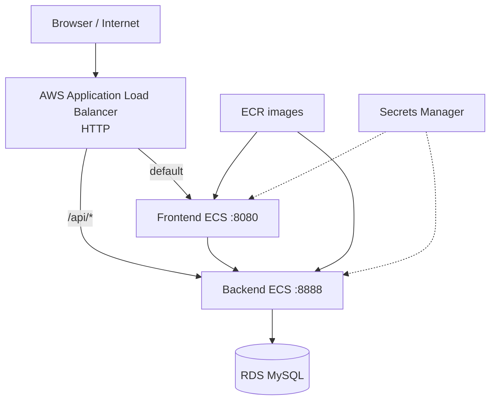

# Deployment architecture

## System architecture

The EduFlow infrastructure is defined with Terraform and includes a VPC, public/private data subnets, security groups, ALB, ECS Fargate, ECR, RDS MySQL, S3, Secrets Manager, and CloudWatch Logs in `ap-southeast-1`.

## Deployment results

- The public ALB DNS returned the homepage and statistics API with HTTP `200`.
- The `main` workflow completed backend tests, frontend tests, Terraform validation, image build/push, and ECS deployment.
- A browser smoke test verified public pages, Vietnamese–English switching, and
  redirecting anonymous checkout to the sign-in page.
- k6 completed 1,758 requests with 50 VUs, a 0.00% failure rate, and 1.84-second p95.
- The application is served through the default AWS Application Load Balancer DNS.
