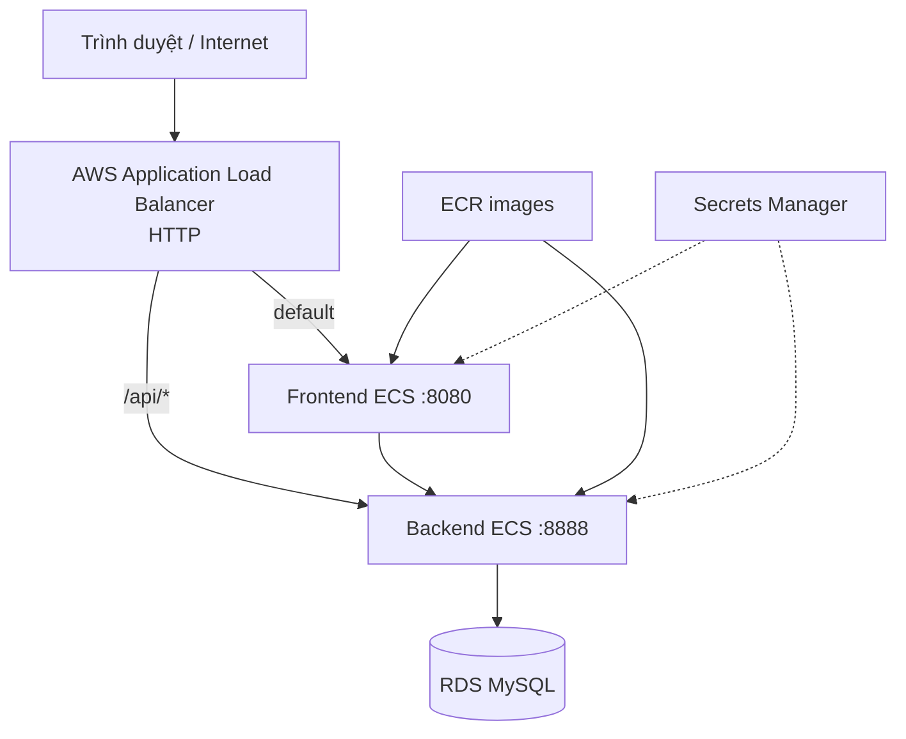

# Kiến trúc triển khai

## Kiến trúc hệ thống

Hạ tầng EduFlow được định nghĩa bằng Terraform, gồm VPC, public/private data subnet, security group, ALB, ECS Fargate, ECR, RDS MySQL, S3, Secrets Manager và CloudWatch Logs tại `ap-southeast-1`.

## Kết quả triển khai

- DNS ALB công khai phản hồi trang chủ và API thống kê bằng HTTP `200`.
- Workflow trên nhánh `main` hoàn tất backend test, frontend test, Terraform validation, build/push image và ECS deployment.
- Smoke test trình duyệt xác minh trang công khai, chuyển Việt–Anh và redirect
  người chưa đăng nhập sang trang đăng nhập khi bắt đầu mua khóa học.
- K6 hoàn thành 1.758 request với 50 VU, tỷ lệ lỗi 0,00% và p95 1,84 giây.
- Ứng dụng được cung cấp qua DNS mặc định của AWS Application Load Balancer.
