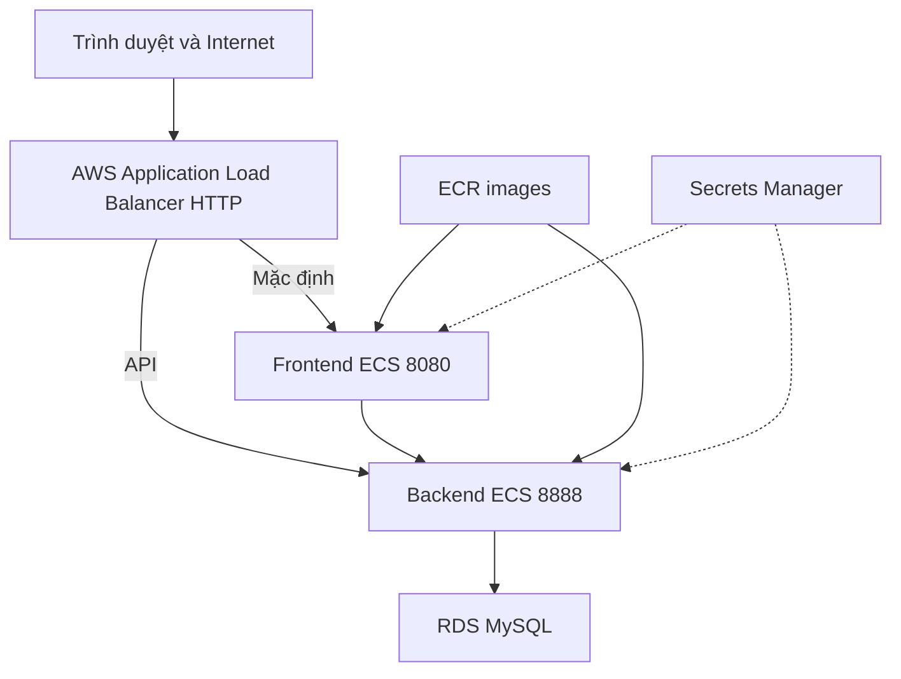

## Kiến trúc hệ thống

Hạ tầng của EduFlow được định nghĩa bằng Terraform và bao gồm Amazon VPC, public/private data subnets, Security Groups, Application Load Balancer (ALB), Amazon ECS Fargate, Amazon ECR, Amazon RDS MySQL, Amazon S3, AWS Secrets Manager và Amazon CloudWatch Logs tại Region `ap-southeast-1`.

## Kết quả triển khai

- DNS công khai của ALB phản hồi thành công trang chủ và API thống kê với mã trạng thái HTTP `200`.
- Workflow trên nhánh `main` hoàn thành các bước kiểm thử backend, kiểm thử frontend, Terraform validation, build/push image và triển khai lên ECS.
- Smoke test trên trình duyệt xác minh các trang công khai, chức năng chuyển đổi giữa tiếng Việt và tiếng Anh, đồng thời chuyển hướng người dùng chưa đăng nhập đến trang đăng nhập khi bắt đầu thanh toán.
- k6 hoàn thành 1.758 request với 50 Virtual Users (VU), tỷ lệ lỗi 0,00% và thời gian phản hồi p95 là 1,84 giây.
- Ứng dụng được cung cấp thông qua DNS mặc định của AWS Application Load Balancer.
